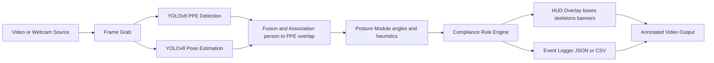

# Pose-Vision: Pose-Aware PPE Compliance (YOLOv8)

Real-time PPE compliance monitoring that fuses **object detection (PPE)** with **human pose estimation** to flag unsafe conditions on the fly.
Works on webcam or video files, overlays a clean HUD, and can log per-frame events for later analysis.

> **TL;DR** → Plug camera/video in → YOLOv8 (PPE + Pose) → rule engine → annotated video & JSON/CSV events.

---
## Demo(screen recording)

https://github.com/user-attachments/assets/cfacd6e7-adf3-48ca-b863-fad9ba254547

---

## ✨ Features

* 🔍 **Dual-model fusion**: YOLOv8 PPE detection + YOLOv8 Pose keypoints
* ⏱ **Per-frame compliance checks**: Hardhat, Mask, Safety Vest + posture cues
* 🎥 **HUD overlays**: Bounding boxes, skeletons, compliance banners
* 📹 **Webcam & file support**: Stream live or process pre-recorded videos
* 🖥 **Pure PyTorch**: No OpenVINO required
* 🗂 **Sample assets**: Ready-to-test images & videos

---

## 🗂️ Repository Structure

```
pose-vision/
├─ scripts/
│  ├─ video_pipeline.py
│  ├─ webcam_pipeline.py
│  └─ test/
│     ├─ fine_tuned_posture.py
│     ├─ improved_pose.py
│     ├─ yolo_pose_image.py
│     ├─ yolo_pose_video.py
│     ├─ yolo_pose_webcam.py
│     └─ yolo_webcam.py
├─ models/
│  ├─ ppe.yaml
│  ├─ yolov8n-pose.pt
│  └─ yolov8n-ppe.pt
├─ assets/
│  ├─ images/input.jpg
│  └─ videos/
│     ├─ example1.mp4
│     ├─ example2.mp4
│     ├─ example_workers.mp4
│     ├─ output_pose.mp4
│     └─ SCreenRec.mp4
└─ Presentation/
   ├─ AI-Powered-PPE-Compliance-Monitoring.pptx.pdf
   └─ Pose-Aware-PPE-Compliance-System.pptx.pdf
```

---

## 🧠 Models & Classes

* **Pose model**: `models/yolov8n-pose.pt`
* **PPE detector**: `models/yolov8n-ppe.pt`
* **Class map (`ppe.yaml`)**:

```
0: Hardhat
1: Mask
2: NO-Hardhat
3: NO-Mask
4: NO-Safety Vest
5: Person
6: Safety Cone
7: Safety Vest
8: machinery
9: vehicle
```

---

## ⚙️ Setup

> Python 3.9+ recommended.

```bash
# Clone repo
git clone https://github.com/Harshitheccentric/pose-vision.git
cd pose-vision

# Create virtual environment
python -m venv .venv
# Windows: .venv\Scripts\activate
# Linux/Mac:
source .venv/bin/activate

# Install dependencies
pip install --upgrade pip
pip install ultralytics opencv-python numpy torch torchvision pyyaml tqdm
```

✅ No OpenVINO dependency needed.

---

## 🚀 Quickstart

### Run on webcam

```bash
python scripts/webcam_pipeline.py \
  --ppe-weights models/yolov8n-ppe.pt \
  --pose-weights models/yolov8n-pose.pt \
  --source 0 \
  --view \
  --save
```

### Run on a video file

```bash
python scripts/video_pipeline.py \
  --ppe-weights models/yolov8n-ppe.pt \
  --pose-weights models/yolov8n-pose.pt \
  --input assets/videos/example_workers.mp4 \
  --out runs/annotated_example.mp4 \
  --save-logs runs/example_events.json
```

---

## 🧩 How It Works

1. **PPE detection** – YOLOv8 finds workers + gear
2. **Pose estimation** – YOLOv8-Pose gives 17 keypoints
3. **Fusion** – Match PPE boxes with persons (IoU overlap)
4. **Posture analysis** – Angles & heuristics (from `fine_tuned_posture.py`)
5. **Rule engine** – Flag violations (e.g., no helmet, bent spine)
6. **Output** – Annotated video + optional JSON/CSV logs

---

## 🏗️ Architecture



---

## 🧪 Test Scripts

Located under `scripts/test/`:

* `yolo_webcam.py` → PPE-only webcam
* `yolo_pose_webcam.py` → Pose-only webcam
* `yolo_pose_video.py` → Pose on video
* `yolo_pose_image.py` → Pose on single image
* `improved_pose.py` → Enhanced visualization
* `fine_tuned_posture.py` → Posture classification logic

---

## 📊 Output Examples

**Video**: Annotated MP4 with skeletons & labels
**Logs** (JSON/CSV):

```json
{
  "frame": 123,
  "person_id": 5,
  "violations": ["NO-Hardhat", "NO-Safety Vest"],
  "posture": {"back_bend_deg": 32.1, "risk": "medium"},
  "timestamp": "00:00:04.10"
}
```

---

## 🔁 Training (Optional)

### Train PPE detection

```bash
yolo detect train data=models/ppe.yaml model=yolov8n.pt imgsz=640 epochs=50 batch=16
```

### Train custom pose model

```bash
yolo pose train data=your_pose.yaml model=yolov8n-pose.pt imgsz=640 epochs=100
```

---

## 🐛 Troubleshooting

* **No webcam feed** → Ensure `--source 0` is correct and camera is free
* **CUDA not detected** → Install correct PyTorch build for your GPU
* **Slow FPS** → Use `yolov8n` for speed; scale up to `s/m/l` only if GPU allows

---
